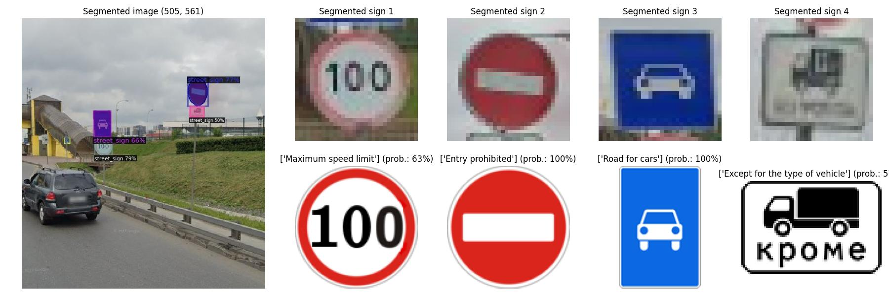
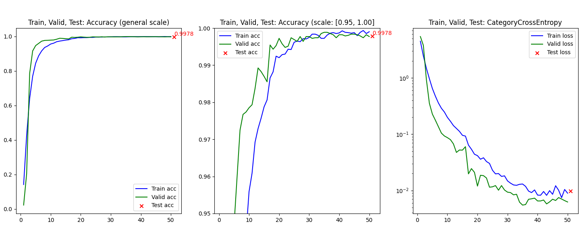

# Traffic sign recognition (... in progress ...)
The task is to recognize and classify road signs from a general image.

Road signs used in post-Soviet countries were chosen as the target type.

More than 95% of road signs in post-Soviet countries are identical, so you can use this model for any of these countries 
(Armenia, Azerbaijan, Belarus, Estonia, Georgia, Kazakhstan, Kyrgyzstan, Latvia, Lithuania, Moldova, Russia, Tajikistan, Turkmenistan, Ukraine and Uzbekistan)

**More details in [Wikipedia](https://en.wikipedia.org/wiki/Traffic_signs_in_post-Soviet_states)**

## Project Structure
- **EDA.ipynb**: Exploratory Data Analysis
- **segmentation.py**: Uses [Detectron2](https://github.com/facebookresearch/detectron2/blob/main/MODEL_ZOO.md) for segmentation road signs in general images:
  - [Segmentation_image/segmented_images/]() - a folder with segmented road signs on general image (jpg-files);
  - [Segmentation_image/segmented_sign_shape/]() - a folders with segmented road signs (png-files);
- **training_model.py** (uses [Training_model/mymodel.py]() - a CNN from scratch):
  - [Training_model/split_dfs/]() - train, valid and test .csv files;
  - [Training_model/trained_models_tf/]() - model weights (.hdf5 files) with the best val_accuracy;
  - [Training_model/res_metrics/]() - .png files with charts of accuracy and loss metrics;
- **testing_model.py**: Uses [best_weights.hdf5](Training_model/models_weights/best_weights.hdf5) and preparing:
  - [Testing_model/res_conf_matrix/]() - folders with confusion matrix for each testing models;
  - [Testing_model/error_analysis/]() - .....
- **inference_model.py**: Python file for ......
  - ....
  - ....
- **.gitattributes**: list of the LFS files for GitHub
- **requirements.txt**: List of required Python modules

## Data
The prepared dataset contains 200 classes, 117.000 images and was also publicly available on Kaggle:
https://www.kaggle.com/datasets/mikhailkosov/traffic-signs-in-post-soviet-states-200-classes

The imbalance of classes is justified by the complexity of the structure and the variety of forms of road signs, on the one hand,
and vice versa - simple and uniform form on the other hand.

**More details in [EDA.ipynb](EDA.ipynb)**

## Training model and evaluation metrics
The dataset was divided in a stratified way (70% train / 15% valid / 15% test): ["Training_model/split_dfs"](Training_model/split_dfs)

Models architecture you can import from here: [Training_model/mymodel.py](Training_model/mymodel.py)

Models were trained for different input road sign shapes: [32x32, 48x48, 64x64]
1) Model 32x32, 43 millions parameters (**import MyModel_32**):
   * Accuracy: 99.66%
   * Macro-average: Precision=0.9973, Recall=0.9967, F1-Score=0.9970
   * Weighted-average: Precision=0.9966, Recall=0.9966, F1-Score=0.9966
   * Pre-trained weights: in folder [Training_model/models_weights/model_43M_32x32_9966.hdf5](Training_model/models_weights/model_43M_32x32_9966.hdf5)
2) Model 48x48, 85 millions parameters (**import MyModel_48**):
   * Accuracy: 99.57%
   * Weighted-average: Precision=0.9959, Recall=0.9957, F1-Score=0.9957
   * Macro-average: Precision=0.9970, Recall=0.9960, F1-Score=0.9965
   * Pre-trained weights: in folder [Training_model/models_weights/model_85M_48x48_9957.hdf5](Training_model/models_weights/model_85M_48x48_9957.hdf5) 
3) Model 64x64, 43 millions parameters (**import MyModel_64**):
   * Accuracy: 99.84%
   * Weighted-average: Precision=0.9984, Recall=0.9984, F1-Score=0.9984
   * Macro-average: Precision=0.9987, Recall=0.9985, F1-Score=0.9986
   * Pre-trained weights: in folder [Training_model/models_weights/model_43M_64x64_9984.hdf5](Training_model/models_weights/model_43M_64x64_9984.hdf5)

* Confusion matrix for all models (png-files): ["Testing_model"](Testing_model)
* Training history plot for all models (png-files): ["Training_model/res_metrics"](Training_model/res_metrics)

## Segmentation
The [Detectron2]((https://github.com/facebookresearch/detectron2/blob/main/MODEL_ZOO.md)) 
(from facebookresearch) was used to segment road signs from general images.

* pip install "git+https://github.com/facebookresearch/detectron2.git"
* The pre-trained weights: [detectron2/LVISv0.5-InstanceSegmentation/mask_rcnn_X_101_32x8d_FPN_1x/](https://dl.fbaipublicfiles.com/detectron2/LVISv0.5-InstanceSegmentation/mask_rcnn_X_101_32x8d_FPN_1x/144219108/model_final_5e3439.pkl)

## Environment
For training on a video card, I used [tensorflow-gpu==2.10.0](https://www.tensorflow.org/install/source_windows). To install this library, you must use the following auxiliary tools:
   * [Bazel 5.1.1](https://github.com/bazelbuild/bazel/releases?q=5.1.1&expanded=true)
   * [cuDNN](https://developer.nvidia.com/rdp/cudnn-archive)
   * [CUDA](https://developer.nvidia.com/cuda-toolkit-archive)
   

