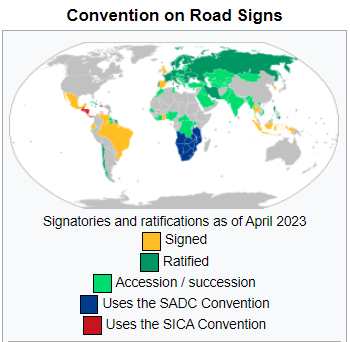

# Traffic sign recognation - project in progress
https://en.wikipedia.org/wiki/Vienna_Convention_on_Road_Signs_and_Signals

## Data
Датасэт для обучения был создан на основе:
https://www.kaggle.com/datasets/daniildeltsov/traffic-signs-gtsrb-plus-162-custom-classes
При этом исходный датасэт был существенным образом преобразован ~ 20-30% (некоторые классы объеденялись, другие наоборот - разъеденялись,
часть изображений удалялась, а так же данные дополнялись из других источников). 

https://en.wikipedia.org/wiki/Traffic_signs_in_post-Soviet_states

### Segmentation - Detectron2
https://github.com/facebookresearch/detectron2/blob/main/MODEL_ZOO.md
pip install 'git+https://github.com/facebookresearch/detectron2.git'

("LVISv0.5-InstanceSegmentation/mask_rcnn_X_101_32x8d_FPN_1x.yaml")

## Training and evaluation

* описание задачи;
* описание продукта, который решает задачу;
* описание окружения (requirements/Docker/etc) с инструкциями установки ;
* скрипты для получения данных и ссылка на данные с разметкой;
* пайплайны ML экспериментов с инструкциями воспроизведения (работа с данными, обучение, валидация, визуализация графиков/дашбордов);
* скрипты продукта с инструкциями полного запуска;
* ссылка на веса моделей, которые используются в проде продукта;
* демки: схемы, картинки, гифки;
* лицензия;
* всё, что считаете полезным для вас/других.