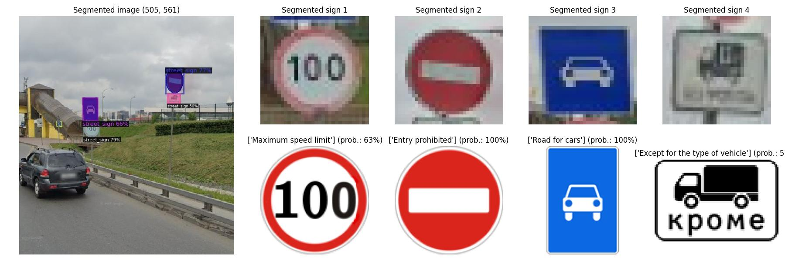
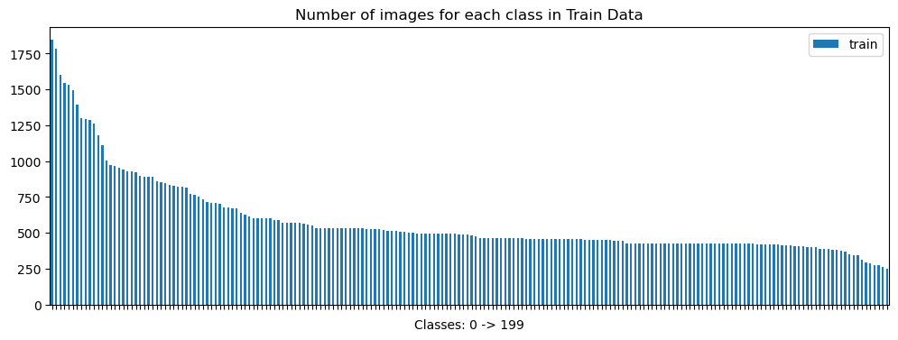
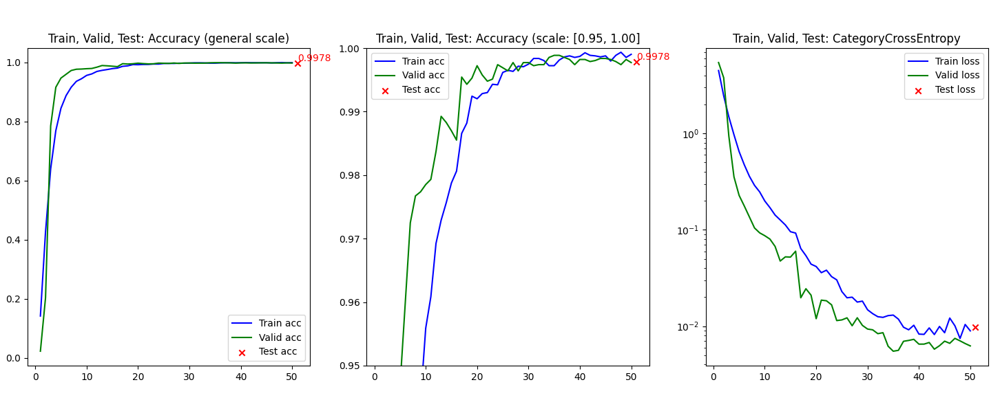
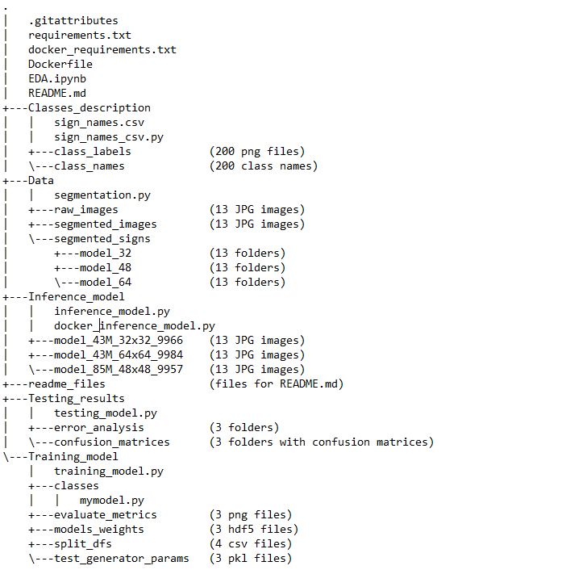
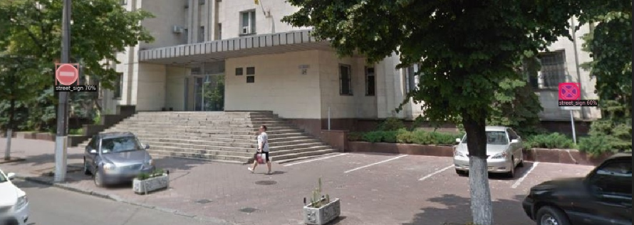
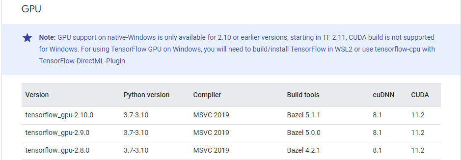
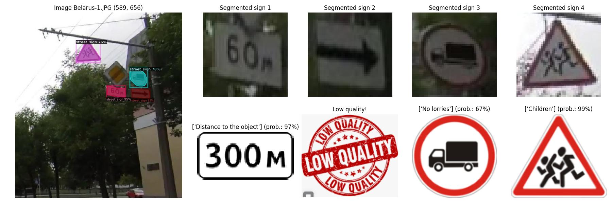

# Traffic sign recognition
The task is to recognize and classify road signs from a general image.

Road signs used in post-Soviet countries were chosen as the target type.

More than 95% of road signs in post-Soviet countries are identical, so you can use this model for any of these countries 
(Armenia, Azerbaijan, Belarus, Estonia, Georgia, Kazakhstan, Kyrgyzstan, Latvia, Lithuania, Moldova, Russia, Tajikistan, Turkmenistan, Ukraine and Uzbekistan)

**More details in [Wikipedia](https://en.wikipedia.org/wiki/Traffic_signs_in_post-Soviet_states)**

## Data
The dataset (prepared by myself) contains 200 classes, 117.000 images and was also publicly available on Kaggle:
https://www.kaggle.com/datasets/mikhailkosov/traffic-signs-in-post-soviet-states-200-classes

The imbalance of classes is explained by the complexity of the structure and the variety of forms of 
road signs, on the one hand, and vice versa - simplicity and uniform on the other hand.

**More details in [EDA.ipynb](EDA.ipynb)**

## Training model and evaluation metrics
The dataset was divided in a stratified way (70% train / 15% valid / 15% test): ["Training_model/split_dfs"](Training_model/split_dfs)

Models architecture you can import from here: [Training_model/classes/mymodel.py](Training_model/classes/mymodel.py)

Models were trained for different input road sign shapes: [32x32, 48x48, 64x64]
1) Model 32x32, 43 millions parameters (**import MyModel_32**):
   * Accuracy: 99.66%
   * Macro-average: Precision=0.9973, Recall=0.9967, F1-Score=0.9970
   * Weighted-average: Precision=0.9966, Recall=0.9966, F1-Score=0.9966
   * Pre-trained weights: in folder [Training_model/models_weights/model_43M_32x32_9966.hdf5](Training_model/models_weights/model_43M_32x32_9966.hdf5)
2) Model 48x48, 85 millions parameters (**import MyModel_48**):
   * Accuracy: 99.57%
   * Weighted-average: Precision=0.9959, Recall=0.9957, F1-Score=0.9957
   * Macro-average: Precision=0.9970, Recall=0.9960, F1-Score=0.9965
   * Pre-trained weights: in folder [Training_model/models_weights/model_85M_48x48_9957.hdf5](Training_model/models_weights/model_85M_48x48_9957.hdf5) 
3) Model 64x64, 43 millions parameters (**import MyModel_64**):
   * Accuracy: 99.84%
   * Weighted-average: Precision=0.9984, Recall=0.9984, F1-Score=0.9984
   * Macro-average: Precision=0.9987, Recall=0.9985, F1-Score=0.9986
   * Pre-trained weights: in folder [Training_model/models_weights/model_43M_64x64_9984.hdf5](Training_model/models_weights/model_43M_64x64_9984.hdf5)

* Confusion matrix for all models (png-files): ["Testing_model"](Testing_results)
* Training history plot for all models (png-files): ["Training_model/res_metrics"](Training_model/evaluate_metrics)

## Project Structure
- **EDA.ipynb**: Exploratory Data Analysis
- **Data/segmentation.py**: 
  - Uses [Detectron2](https://github.com/facebookresearch/detectron2/blob/main/MODEL_ZOO.md) for segmentation of road signs in general images:
  - Uses [Data/raw_images/](Data/raw_images) - general images;
  - Prepares [Data/segmented_images/](Data/segmented_images) - segmented road signs on general image;
  - Prepares [Data/segmented_signs/](Data/segmented_signs) - cut out road signs;
- **Training_model/training_model.py**: 
  - Uses downloaded dataset from [Kaggle](https://www.kaggle.com/datasets/mikhailkosov/traffic-signs-in-post-soviet-states-200-classes);
  - Uses [Training_model/classes/mymodel.py](Training_model/classes) - CNN from scratch;
  - Prepares [Training_model/split_dfs/](Training_model/split_dfs) - train, valid and test files (.csv);
  - Prepares [Training_model/models_weights/](Training_model/models_weights) - model weights (.hdf5);
  - Prepares [Training_model/evaluate_metrics/](Training_model/evaluate_metrics) - charts of accuracy and loss;
  - Prepares [Training_model/test_generator_params/](Training_model/test_generator_params) - test_generator parameters; 
- **Testing_results/testing_model.py**: 
  - Uses downloaded dataset from [Kaggle](https://www.kaggle.com/datasets/mikhailkosov/traffic-signs-in-post-soviet-states-200-classes); 
  - Uses [Training_model/classes/mymodel.py](Training_model/classes) - CNN from scratch;
  - Uses [Training_model/models_weights/weights.hdf5](Training_model/models_weights) - pre-trained model-weights;
  - Uses [Training_model/test_generator_params/parameters.pkl](Training_model/test_generator_params) - test_generator parameters;
  - Prepares [Testing_model/confusion_matrices/]() - confusion matrices for each testing models;
  - Prepares [Testing_model/error_analysis/]() - not ready yet;
- **Inference_model/inference_model.py**:
  - Uses [Training_model/classes/mymodel.py](Training_model/classes) - CNN from scratch;
  - Uses [Training_model/models_weights/weights.hdf5](Training_model/models_weights) - pre-trained model-weights;
  - Uses [Data/segmented_images/](Data/segmented_images) - segmented road signs on general image;
  - Uses [Data/segmented_signs/](Data/segmented_signs) - cut out road signs;
  - Uses [Classes_description/class_labels/](Classes_description/class_labels) - labels of road signs;
  - Prepare [Inference_model/name_model/](Inference_model) test images with segmented and cut out road signs and predicted signs; 
- **Classes_description/sign_names_csv.py**:
  - Uses [Classes_description/class_names]() - road sign labels in named folders;
  - Prepare [Classes_description/sign_names.csv](Classes_description) - dataframe with names of road sign classes;
- **readme_files/** - folder with images for the file **README.md**
- **.gitattributes**: list of the LFS files (model weights)
- **requirements.txt**: List of required Python modules
- **docker_requirements.txt**: List of required Python modules for deployment docker image
- **Dockerfile**: Create docker image for model inference

## How to RUN
1) Preparing data
   * Download the dataset (15GB) from [Kaggle (traffic-signs-in-post-soviet-states-200)](https://www.kaggle.com/datasets/mikhailkosov/traffic-signs-in-post-soviet-states-200-classes)
   * Run **sign_names_csv.py**
2) Training model
   * Open **training_model.py** and set-up CUSTOM PARAMETERS:
     * "**KERNEL**": [32, 48, 64]
     * "**model**": [MyModel_32, MyModel_48, MyModel_64]
     * "**PATH_data**": Path to the downloaded dataset (from [Kaggle](https://www.kaggle.com/datasets/mikhailkosov/traffic-signs-in-post-soviet-states-200-classes))
   * Run **training_model.py**
3) Testing model
   * Open **testing_model.py** and set-up CUSTOM PARAMETERS:
     * "**name_weight**": [model_43M_32x32.hdf5, model_85M_48x48.hdf5, model_43M_64x64.hdf5]
     * "**model**": [MyModel_32, MyModel_48, MyModel_64]
     * "**PATH_data**": Path to the downloaded dataset (from [Kaggle](https://www.kaggle.com/datasets/mikhailkosov/traffic-signs-in-post-soviet-states-200-classes))
   * Run **testing_model.py**
4) Prepare own data for inference
   * Download your own general image (with traffic signs): [Data/raw_images](Data/raw_images) 
   * Open **segmentation.py** and set-up CUSTOM PARAMETERS:
     * "**SIZE**": [32, 48, 64]
   * Run **segmentation.py**
5) Inference
   * Open **inference_model.py** and set-up CUSTOM PARAMETERS:
     * "**name_weight**": [model_43M_32x32.hdf5, model_85M_48x48.hdf5, model_43M_64x64.hdf5]
     * "**model**": [MyModel_32, MyModel_48, MyModel_64]
   * Run **inference_model.py**

## Deployment Inference with Docker
At the moment, it only allows you to compare the final image with segmented road signs and the predictions made 
for each sign (all images are taken from the folders: "Data/segmented_images" and "Data/segmented_signs"

1. Pull the Docker Image:
   * docker pull gurzuff/road_sign_classification:latest
2. Run the Docker Container:
   * docker run --rm -v /local/path:/app/inference_docker gurzuff/road_sign_classification:latest

!Ensure to replace "**/local/path**" with the local directory where you want to store the inference results.

## Segmentation
The [Detectron2](https://github.com/facebookresearch/detectron2/blob/main/MODEL_ZOO.md)
(from facebookresearch) was used to segment road signs from general images.

* pip install "git+https://github.com/facebookresearch/detectron2.git"
* The pre-trained weights: [detectron2/LVISv0.5-InstanceSegmentation/mask_rcnn_X_101_32x8d_FPN_1x/](https://dl.fbaipublicfiles.com/detectron2/LVISv0.5-InstanceSegmentation/mask_rcnn_X_101_32x8d_FPN_1x/144219108/model_final_5e3439.pkl)

* 

## Environment
For training on a video card, I used [tensorflow-gpu==2.10.0](https://www.tensorflow.org/install/source_windows). To install this library, you must use the following auxiliary tools:
   * [Bazel 5.1.1](https://github.com/bazelbuild/bazel/releases?q=5.1.1&expanded=true)
   * [cuDNN](https://developer.nvidia.com/rdp/cudnn-archive)
   * [CUDA](https://developer.nvidia.com/cuda-toolkit-archive)

## Next stages of development
0. Expand dockerization
1. Retrain the detectron2 model to improve road sign detection: 
    * Sign "End of the priority road" - not detected;
2. Add a text/character recognition model for more accurate character classification:
    * Sign "Distance to the object" - value ("60м") not recognized.

