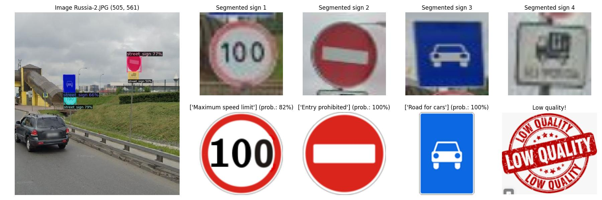
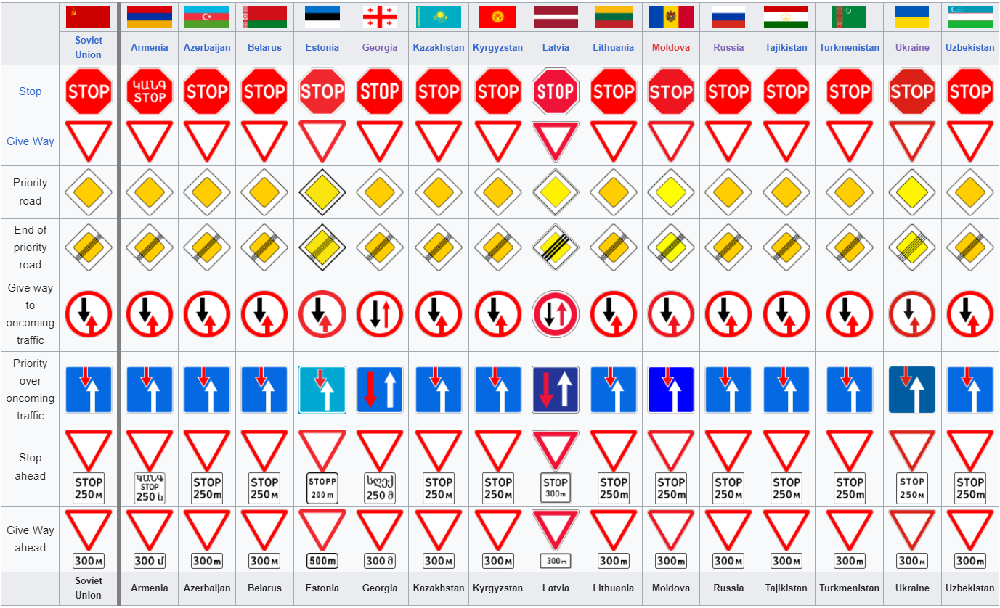
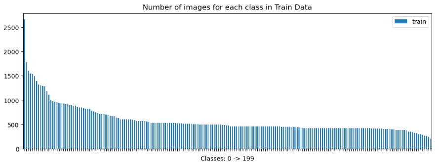
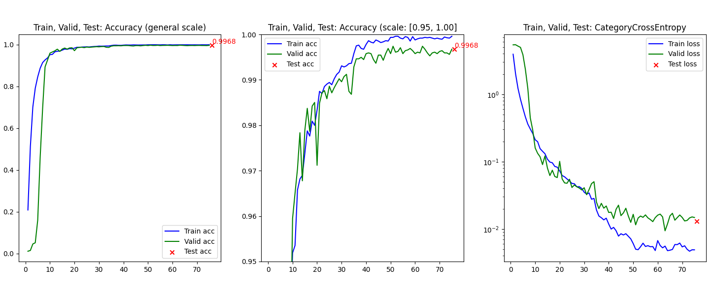
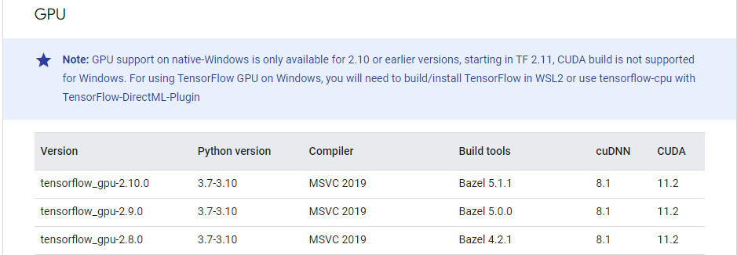

# Traffic sign recognition (... in progress ...)
The task is to recognize and classify road signs from a general image.

Road signs used in post-Soviet countries were chosen as the target type.

More than 95% of road signs in post-Soviet countries are identical, so you can use this model for any of these countries 
(Armenia, Azerbaijan, Belarus, Estonia, Georgia, Kazakhstan, Kyrgyzstan, Latvia, Lithuania, Moldova, Russia, Tajikistan, Turkmenistan, Ukraine and Uzbekistan)

**More details in [Wikipedia](https://en.wikipedia.org/wiki/Traffic_signs_in_post-Soviet_states)**

## Project Structure
- **EDA.ipynb**: Jupyter notebook analyzing the dataset
- **segmentation.py**: Uses [Detectron2](https://github.com/facebookresearch/detectron2/blob/main/MODEL_ZOO.md) for segmentation road signs and preparing:
  - [Segmentation_image/segmented_images/]() - .jpg files with segmented road signs on general image;
  - [Segmentation_image/segmented_sign/]() - a folders with .png files (segmented road signs);
- **training_model.py**: Uses [Training_model/mymodel.py]() - a self-written CNN from scratch and preparing:
  - [Training_model/split_dfs/]() - train, valid and test .csv files;
  - [Training_model/trained_models_tf/]() - model weights (.hdf5 files) with the best val_accuracy;
  - [Training_model/res_metrics/]() - .png files with charts of accuracy and loss metrics;
- **testing_model.py**: Uses [best_weights.hdf5](Training_model/trained_models_tf/best_weights.hdf5) and preparing:
  - [Testing_model/res_conf_matrix/]() - folders with confusion matrix for each testing models;
  - [Testing_model/error_analysis/]() - .....
- **inference_model.py**: Python file for ......
- **.gitattributes**: list of the LFS files for GitHub
- **requirements.txt**: List of required Python modules

## Data
The prepared dataset contains 200 classes, 117.000 images and was also publicly available on Kaggle:
https://www.kaggle.com/datasets/mikhailkosov/traffic-signs-in-post-soviet-states-200-classes

The imbalance of classes is justified by the complexity of the structure and the variety of forms of road signs, on the one hand,
and vice versa - simple and uniform form on the other hand.

**More details in [EDA.ipynb](EDA.ipynb)**

## Evaluation Metrics
For training, validation and testing, the dataset was divided in a stratified way (70/15/15): [Training_model/split_dfs]()
* pre-trained weights: [Training_model/trained_models_tf/](Training_model/trained_models_tf/best_weights.hdf5);
* chart metrics: [Training_model/res_metrics/]()

## Segmentation
The [Detectron2]((https://github.com/facebookresearch/detectron2/blob/main/MODEL_ZOO.md)) 
(from facebookresearch) was used to segment road signs from general images.

* pip install "git+https://github.com/facebookresearch/detectron2.git"
* The pre-trained weights: [detectron2/LVISv0.5-InstanceSegmentation/mask_rcnn_X_101_32x8d_FPN_1x/](https://dl.fbaipublicfiles.com/detectron2/LVISv0.5-InstanceSegmentation/mask_rcnn_X_101_32x8d_FPN_1x/144219108/model_final_5e3439.pkl)

## Environment
For training on a video card, I used [tensorflow-gpu==2.10.0](https://www.tensorflow.org/install/source_windows). To install this library, you must use the following auxiliary tools:
   * [Bazel 5.1.1](https://github.com/bazelbuild/bazel/releases?q=5.1.1&expanded=true)
   * [cuDNN](https://developer.nvidia.com/rdp/cudnn-archive)
   * [CUDA](https://developer.nvidia.com/cuda-toolkit-archive)
   

