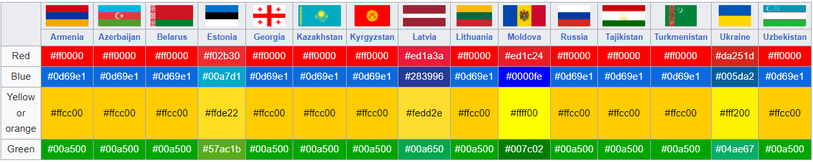

# Traffic sign recognation - project in progress
https://en.wikipedia.org/wiki/Vienna_Convention_on_Road_Signs_and_Signals

## Data
https://www.kaggle.com/datasets/daniildeltsov/traffic-signs-gtsrb-plus-162-custom-classes

https://en.wikipedia.org/wiki/Traffic_signs_in_post-Soviet_states

### Segmentation - Detectron2
https://github.com/facebookresearch/detectron2/blob/main/MODEL_ZOO.md
pip install 'git+https://github.com/facebookresearch/detectron2.git'

("LVISv0.5-InstanceSegmentation/mask_rcnn_X_101_32x8d_FPN_1x.yaml")
